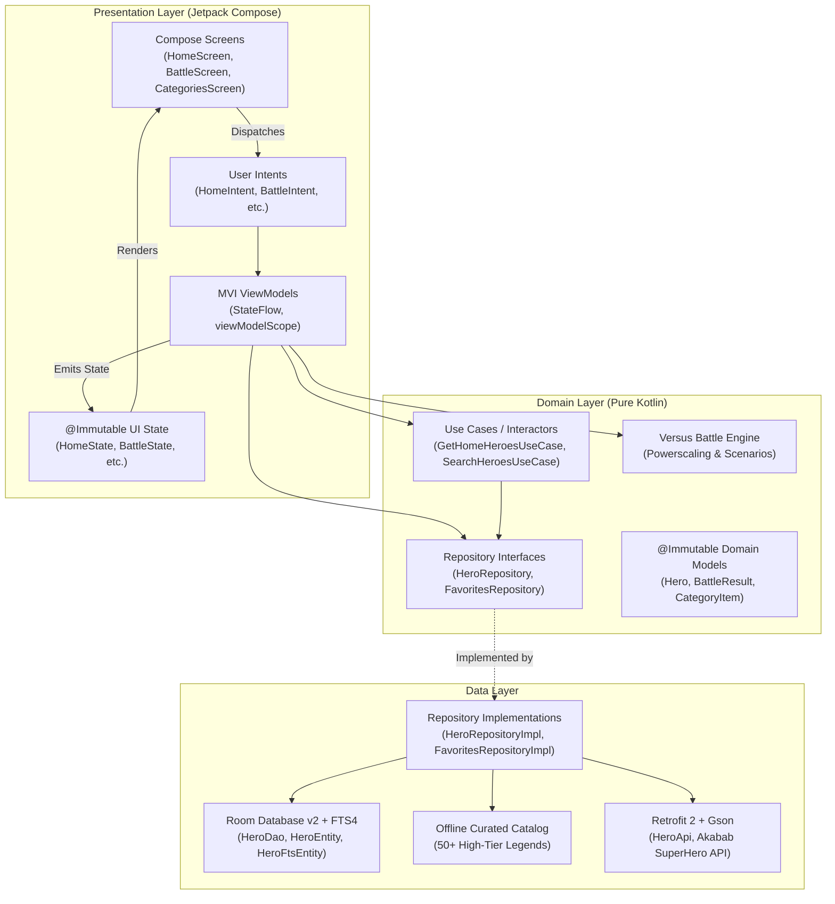

# ⚡ HeroHub — The Ultimate Superhero Multiverse & Versus Arena

<div align="center">

[](https://android.com)
[](https://kotlinlang.org)
[](https://developer.android.com/jetpack/compose)
[](https://developer.android.com/topic/architecture)
[](https://developer.android.com/training/data-storage/room)
[](https://insert-koin.io/)
[-00C853?style=for-the-badge&logo=android&logoColor=white)](https://developer.android.com)
[-00ACC1?style=for-the-badge&logo=android&logoColor=white)](https://developer.android.com)
[](https://developer.android.com/topic/performance)
[](LICENSE)

**HeroHub** is a production-grade, state-of-the-art Android application built with **Kotlin 2.0**, **Jetpack Compose (Material 3)**, **Room SQLite with FTS4**, and **Clean Architecture with MVI (Model-View-Intent)**. It empowers comic fans to discover, analyze, compare, and simulate hypothetical battles between **730+ superheroes and villains** from Marvel, DC, and independent comic universes—operating with 100% offline-first reliability and locked 60/120 FPS buttery-smooth performance.

[Features](#-key-features) • [Versus Arena](#-versus-arena--battle-simulator) • [Performance Engine](#-performance--speedy-ui-engine) • [Architecture](#-architecture--design-patterns) • [Tech Stack](#-technology-stack) • [Getting Started](#-getting-started) • [Roadmap](#-milestone-roadmap)

</div>

---

## 🌟 Overview

HeroHub is engineered from the ground up to demonstrate modern, high-performance Android development best practices. It combines comic-book excitement with rigorous software engineering:
* **730+ Global Superhero Registry**: Extracted live from the Akabab SuperHero API and persistently cached in a local Room SQLite database with full-text search (FTS4).
* **Versus Arena & Battle Simulator**: An algorithmic combat engine that scales fighters across 6 tactical categories and 3 battle scenarios (Standard, 24h Prep Time, Morals-Off Bloodlusted).
* **Scroll-Triggered Infinite Pagination**: Smooth progressive 36-hero batching that eliminates main-thread stalls and guarantees zero jank.
* **Hardware-Accelerated Image Pipeline**: Direct zero-copy GPU Hardware Bitmaps via Coil with instant background monogram fallbacks and 120MB offline cache.
* **Complete Compose Stability**: `@Immutable` models guaranteeing 100% recomposition skipping during scroll and fluid 60/120 FPS navigation transitions.

---

## 🚀 Key Features

### 🏠 1. Attractive Multiverse Home Experience
* **Branded Multiverse Archive Header**: High-impact header displaying `⚡ HEROHUB MULTIVERSE ARCHIVE`, a live counter (`730+ Multiverse Legends Archive`), and an instant **"⚔️ Versus"** shortcut pill button.
* **Multiverse Universe Portals**: Authentic neon-gradient realm portals for instantaneous universe browsing:
  * 🔴 **Marvel Universe** (`EARTH-616`, 280+ characters)
  * 🔵 **DC Multiverse** (`PRIME EARTH`, 220+ characters)
  * ⚡ **Cosmic & Gods** (`GOD TIER`, Power 90+)
  * 🪐 **Indie Legends** (`INDEPENDENT`, Image & Dark Horse)
  * 💀 **Villains Vault** (`ANTAGONISTS`, Gotham Rogues, Cosmic Warlords)
* **⚔️ "Clash of the Day" Showcase**: Daily spotlight matchup card with side-by-side fighter portraits, power ratings, glowing animated `VS` badge, and a **"Simulate Clash in Arena"** button that pre-loads the contenders into the Versus Arena.
* **Cinematic Hero Spotlight Carousel**: Edge-to-edge poster cards featuring publisher-specific badges, power stat mini-pills (`STR`, `INT`, `SPD`, `PWR`), and animated capsule pager dots.
* **Olympic Power Hierarchy Leaderboard**:
  * 🥇 **#1 Rank**: Radiant gold border with `"GOD TIER"` badge
  * 🥈 **#2 Rank**: Chrome silver border with `"COSMIC"` badge
  * 🥉 **#3 Rank**: Bronze metallic border with `"ALPHA"` badge
* **Interactive Hero Dossiers**: Comprehensive modal bottom sheets with physical attributes, occupations, biographical lore, powerscaling, and comic affiliations.

---

### ⚔️ 2. Versus Arena & Battle Simulator
HeroHub features a sophisticated, deterministic combat simulation engine inspired by comic debate tiering and powerscaling frameworks:
* **Dual Fighter Picker**: Choose any two combatants from the 730+ hero multiverse with instant search filtering.
* **Three Battle Scenarios**:
  * **Standard Encounter**: Neutral arena clash with both fighters in-character (morals on, no prior knowledge).
  * **24-Hour Prep Time**: Both combatants receive 24h of intel, resource access, and tactical planning (grants intelligence-scaled stat boosts; tactical masterminds gain decisive edges).
  * **Bloodlusted / Morals Off**: Moral inhibitors removed; 100% lethal speed-blitzing and extreme aggression (amplifies speed, power, and kinetic lethality).
* **6-Category Analytical Breakdown**:
  * 🧠 **Intelligence**: Tactical deduction, scientific mastery, cognitive processing.
  * 💪 **Strength**: Raw physical lifting, striking force, and kinetic devastation.
  * ⚡ **Speed**: Velocity, reflex reaction time, and combat speed.
  * 🛡️ **Durability**: Physical invulnerability, armor density, and regeneration.
  * 🔮 **Power**: Energy projection, mystic arts, and reality-warping scale.
  * 🥋 **Combat**: Hand-to-hand fluency, martial arts mastery, and warfare experience.
* **Battle Outcome Analytics**:
  * **Victory & Probability Calculation**: Realistic win percentages (50%–99%) based on category margins and stat dominance.
  * **Deciding Tactical Factor**: Explains the exact reason behind the win (e.g. Speed Blitz, Prep Advantage, Cosmic Scale).
  * **Key Vulnerability**: Identifies the losing fighter's critical flaw.
  * **Tactical Lore Summary**: Complete narrative simulation breakdown of how the encounter unfolds.

---

### 🌌 3. Multiverse Categories & Infinite Scroll
* **Global Registry ("All Heroes 700+")**: Direct access to the complete 731-character library extracted from the API.
* **Curated Subcategories**: Deep exploration into *Avengers*, *Justice League*, *Bat-Family*, *X-Men*, *Illuminati*, *Arkham Rogues*, and *Omega Level Mutants*.
* **Scroll-Triggered Infinite Pagination**:
  * Progressively ingests heroes in batches of **36** as the user scrolls.
  * Top counter displays live progression: `"Showing 36 of 731 characters"` $\rightarrow$ `"731 characters found"`.
  * Dynamic loading footer with animated indicators.
  * Auto-resets pagination and scrolls to top on category/filter switch.
* **Dual View Modes**: Seamless toggle between multi-column adaptive **Grid View** and ranked **List View**.

---

### 🔍 4. Instant Search & Full-Text Engine
* **Room FTS4 Full-Text Search**: Sub-millisecond SQLite match across hero names, real names, publishers, and affiliations.
* **Real-Time Debounced Querying**: 350ms input debouncing with background thread filtering.
* **Search History & Trending Cloud**: One-tap recent search deletion and popular hero recommendation pills.
* **Multi-Attribute Filter Sheet**: Universe pills, moral alignment chips, dual-thumb power rating sliders (0–100), and dynamic sorting options.

---

### 🛡️ 5. Superhero Squad (Favorites) & Settings
* **Squad Combat Metrics**: Live squad analytics including total members, average squad power rating, and top active powerhouse.
* **Theme Modes**: Seamless toggling between **System Default**, **Dark Mode**, and **Light Mode**.
* **Coil Cache Inspector**: Real-time disk cache calculation and one-tap image cache clearance.

---

## ⚡ Performance & Speedy UI Engine

HeroHub is heavily optimized for smooth, stutter-free performance across all Android devices:

```
┌────────────────────────────────────────────────────────────────────────┐
│                        HEROHUB PERFORMANCE ENGINE                      │
├────────────────────────────────────────────────────────────────────────┤
│ 🖼️ ZERO-SUBCOMPOSITION HARDWARE BITMAPS                                │
│   • Replaced SubcomposeAsyncImage with coil.compose.AsyncImage         │
│   • Background letter monogram renders with 0 subcomposition overhead │
│   • allowHardware(true) decodes directly to GPU graphics memory        │
│   • 120MB disk cache keeps all 730+ portraits cached 100% offline      │
├────────────────────────────────────────────────────────────────────────┤
│ ⚡ COMPOSE RECOMPOSITION SKIPPING (@Immutable)                         │
│   • Annotated Hero, CategoryItem, BattleResult, and all screen states  │
│   • Skips recomposition of off-screen/unchanged cards during scroll    │
│   • Virtualized LazyColumn row keys guarantee locked 60/120 FPS        │
├────────────────────────────────────────────────────────────────────────┤
│ 🎬 FLUID SCREEN TRANSITIONS                                            │
│   • NavHost enter: fadeIn(220ms) + slideInHorizontally(40dp)          │
│   • NavHost exit:  fadeOut(180ms) + slideOutHorizontally(-40dp)       │
│   • Splash screen: gentle fadeOut(300ms) into Home Screen              │
├────────────────────────────────────────────────────────────────────────┤
│ 🗄️ SQLITE B-TREE INDEXING                                              │
│   • Indexed: [powerRating, publisher, alignment] in Room database      │
│   • ORDER BY and WHERE queries execute in sub-milliseconds             │
├────────────────────────────────────────────────────────────────────────┤
│ 👆 BOUNDED TOUCH RIPPLES                                               │
│   • Standardized Card(onClick = ...) with clean corner clipping        │
└────────────────────────────────────────────────────────────────────────┘
```

---

## 📱 Universal Device & Screen Support

HeroHub is engineered for universal Android compatibility, avoiding device-specific assumptions:

* **Adaptive Grid Layouts**:
  $$\text{Columns} = \begin{cases} 4 & \text{if } \text{screenWidth} \ge 840\text{ dp (Tablets, Desktops)} \\ 3 & \text{if } \text{screenWidth} \ge 600\text{ dp (Foldables, Landscape)} \\ 2 & \text{otherwise (Compact Phones)} \end{cases}$$
* **Edge-to-Edge System Integration**: Full `enableEdgeToEdge()` compatibility honoring system bars and navigation insets.
* **Touch Target Accessibility**: Minimum 48dp touch targets and descriptive accessibility semantics throughout.

---

## 🏛 Architecture & Design Patterns

HeroHub implements **Clean Architecture** paired with **MVI (Model-View-Intent)** to ensure strict separation of concerns, testability, and predictability.



### Unidirectional Data Flow (UDF)
1. **User Action**: The user interacts with the UI (e.g., clicks favorite, selects fighters for battle, types search query).
2. **Intent Emission**: The UI dispatches an immutable `Intent` sealed interface to the `ViewModel`.
3. **Business Execution**: The `ViewModel` interacts with the `BattleEngine`, Use Cases, or Repositories using Kotlin Coroutines on `Dispatchers.Default` / `Dispatchers.IO`.
4. **State Mutation**: The `ViewModel` atomically updates its private `MutableStateFlow` using `_state.update { ... }`.
5. **State Rendering**: The Composable screen observes the public `StateFlow<T>` and recomposes deterministically, skipping unneeded recompositions via `@Immutable` stability.

---

## 🛠 Technology Stack

| Category | Technology | Version | Purpose |
| :--- | :--- | :--- | :--- |
| **Language** | Kotlin | `2.0.0` | Modern language with K2 Compose compiler plugin |
| **Build Tool** | Gradle / AGP | `8.4.1` | Automated build system and Version Catalogs |
| **UI Framework** | Jetpack Compose | `BOM 2024.06.00` | Declarative UI toolkit with Material 3 |
| **Local Persistence** | Room Database | `2.6.1` | SQLite database with B-Tree indices |
| **Full-Text Search** | Room FTS4 | `2.6.1` | Instant offline search across 730+ heroes |
| **Annotation Processing**| KSP | `2.0.0-1.0.24` | Kotlin Symbol Processing for Room DB |
| **Design System** | Material 3 | `1.2.1` | Custom tokens (Radius, Dimensions, Elevation) |
| **Architecture** | Clean Architecture + MVI | — | Modular, reactive, and highly scalable |
| **Dependency Injection** | Koin | `3.5.6` | Pragmatic DI for Android & Jetpack Compose |
| **Asynchronous** | Kotlin Coroutines & Flow | `1.8.1` | Reactive streams & non-blocking concurrency |
| **Networking** | Retrofit 2 + Gson | `2.11.0` | Type-safe REST client for Superhero API |
| **Image Loading** | Coil | `2.6.0` | Hardware Bitmaps, 120MB disk cache, AsyncImage |
| **Navigation** | Navigation Compose | `2.8.9` | Fluid animated slide/fade screen routing |
| **Splash Screen** | Core Splashscreen | `1.0.1` | Native Android 12+ backward-compatible splash |
| **Unit Testing** | JUnit 4 | `4.13.2` | Isolated JVM unit testing |

---

## 📂 Project Structure

```
HeroHub/
├── app/
│   ├── src/
│   │   ├── main/
│   │   │   ├── java/com/vedantraut/herohub/
│   │   │   │   ├── HeroHubApp.kt             # Application class & Hardware ImageLoaderFactory
│   │   │   │   ├── MainActivity.kt           # Edge-to-edge entry activity
│   │   │   │   │
│   │   │   │   ├── data/                     # Data Layer
│   │   │   │   │   ├── local/                # Room DB, DAOs, Entities, FTS4, Curated Catalog
│   │   │   │   │   │   ├── catalog/CuratedHeroCatalog.kt
│   │   │   │   │   │   ├── dao/HeroDao.kt
│   │   │   │   │   │   ├── database/HeroDatabase.kt (v2)
│   │   │   │   │   │   └── entity/HeroEntity.kt, HeroFtsEntity.kt
│   │   │   │   │   ├── remote/api/HeroApi.kt
│   │   │   │   │   └── repository/HeroRepositoryImpl.kt
│   │   │   │   │
│   │   │   │   ├── domain/                   # Domain Layer
│   │   │   │   │   ├── battle/BattleEngine.kt # Versus Battle Simulator Engine
│   │   │   │   │   ├── model/Hero.kt, battle/BattleModels.kt
│   │   │   │   │   └── repository/HeroRepository.kt
│   │   │   │   │
│   │   │   │   ├── presentation/             # Presentation Layer (MVI)
│   │   │   │   │   ├── battle/               # Versus Arena Screen & ViewModel
│   │   │   │   │   ├── home/                 # Home Screen, Portals, Clash, Carousel
│   │   │   │   │   │   └── components/       # ClashOfTheDay, UniversePortals, HeroCard
│   │   │   │   │   ├── categories/           # Infinite Scroll Grid & Drilldowns
│   │   │   │   │   ├── search/               # Real-Time Search & Autocomplete
│   │   │   │   │   ├── favorites/            # Squad Metrics & Roster
│   │   │   │   │   ├── settings/             # Theme & Coil Cache Inspector
│   │   │   │   │   └── navigation/           # Animated NavHost & Transitions
│   │   │   │   │
│   │   │   │   └── ui/designsystem/          # Themes, Colors, Dimensions & Tokens
│   │   │   │
│   │   │   └── res/                          # Drawables, Strings, Mipmaps
│   │   │
│   │   └── test/                             # Unit tests (BattleEngineTest, CatalogTest)
│   │
│   └── build.gradle.kts
│
├── gradle/libs.versions.toml
├── build.gradle.kts
└── settings.gradle.kts
```

---

## 🎨 Design System & Theming

HeroHub implements a bespoke design system with design tokens that guarantee consistent visual hierarchy, spacing, and micro-interactions:

* **Tailored Palettes**: High-contrast dark mode with sleek deep onyx (`#0D0D0D`), dark graphite (`#1A1A1A`), and vibrant superhero accents.
* **Typography Tokens**: Complete type scale built on Material 3 (`HeroHubTypography`) featuring distinct hierarchy from `headlineLarge` to `labelSmall`.
* **Spatial System**: Structured dimension tokens (`HeroHubDimensions.space2` through `space32`) ensuring mathematically balanced padding and margins.
* **Corner Radius**: Standardized curvature tokens (`HeroHubRadius.small` = 4dp up to `extraLarge` = 24dp, `full` = 999dp).
* **Elevations**: Cohesive shadow and depth management via `HeroHubElevation`.

---

## 🏁 Getting Started

### Prerequisites
* **Android Studio**: Ladybug (2024.2+) or Koala Feature Drop
* **JDK**: Version 17
* **Android SDK**: API 35 (Android 15) installed
* **Gradle**: 8.4+ (bundled with Gradle Wrapper)

### Installation & Build

1. **Clone the repository**:
   ```bash
   git clone https://github.com/VEDANTSUNILRAUT/HeroHub.git
   cd HeroHub
   ```

2. **Open in Android Studio**:
   * Select **File** > **Open...** and choose the `HeroHub` directory.
   * Allow Gradle to sync dependencies via the Version Catalog.

3. **Compile the Debug APK**:
   ```bash
   ./gradlew assembleDebug
   ```

4. **Execute Unit Tests**:
   ```bash
   ./gradlew testDebugUnitTest
   ```

5. **Run on Device or Emulator**:
   * Select a target device running **Android 8.0 (API 26)** or higher and click **Run** (`Shift + F10`).

---

## 🗺️ Milestone Roadmap

- [x] **Phase 1: Foundation & Base Architecture** — Multi-module Gradle, Kotlin 2.0, Compose BOM.
- [x] **Phase 2: Network & Data Layer** — Akabab Superhero API, Retrofit 2, and DTO mappers.
- [x] **Phase 3: Design System & Tokens** — High-contrast dark theme, spatial dimensions, and corner radii.
- [x] **Phase 4: Navigation Foundation** — Navigation Compose with persistent top and bottom bars.
- [x] **Phase 5: Home Screen Overhaul** — Branded header, Universe Portals, Clash of the Day, and Olympic Hierarchy.
- [x] **Phase 6: Room Database & FTS4** — Complete 731-character offline persistence and full-text search.
- [x] **Phase 7: Versus Arena & Battle Engine** — Deterministic combat engine, scenarios, and powerscaling breakdown.
- [x] **Phase 8: Infinite Scroll Pagination** — Progressive 36-hero batching and lazy row virtualization.
- [x] **Phase 9: Android Performance & Polish Engine** — Hardware Bitmaps, `@Immutable` stability, and fluid slide/fade screen transitions.
- [x] **Phase 10: Squad Favorites & Search** — Live battle squad metrics and debounced multi-attribute search.
- [ ] **Phase 11: Audio & Sound FX** — Multiverse portal soundscapes and battle clash audio effects.

---

## 📄 License

```
Copyright 2026 Vedant Raut

Licensed under the Apache License, Version 2.0 (the "License");
you may not use this file except in compliance with the License.
You may obtain a copy of the License at

    http://www.apache.org/licenses/LICENSE-2.0

Unless required by applicable law or agreed to in writing, software
distributed under the License is distributed on an "AS IS" BASIS,
WITHOUT WARRANTIES OR CONDITIONS OF ANY KIND, either express or implied.
See the License for the specific language governing permissions and
limitations under the License.
```

---

<div align="center">

Crafted with ❤️ by **[Vedant Raut](https://github.com/VEDANTSUNILRAUT)**

</div>