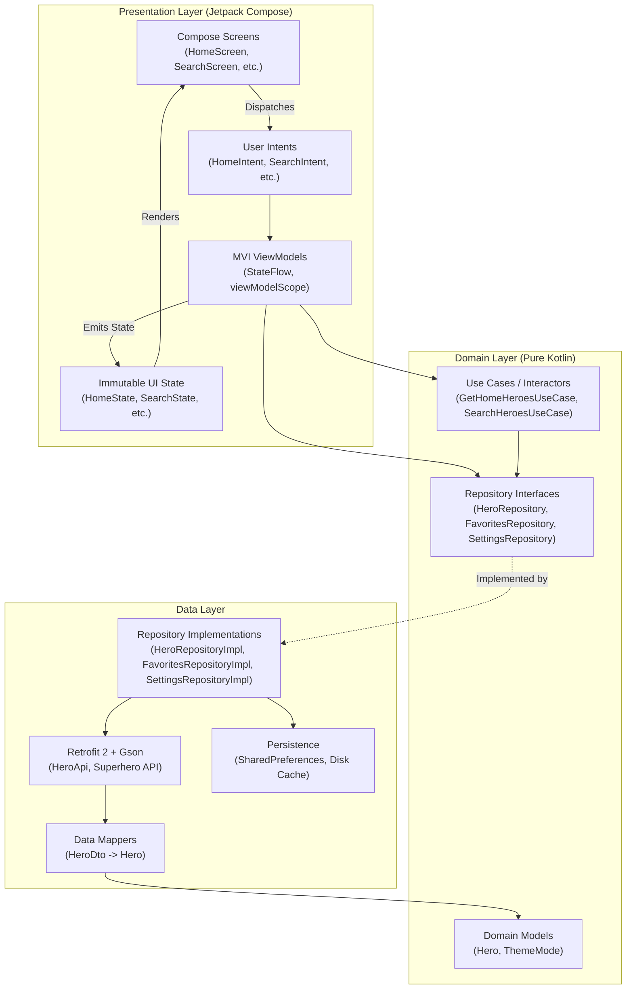

# ⚡ HeroHub — The Ultimate Superhero Universe

<div align="center">

[](https://android.com)
[](https://kotlinlang.org)
[](https://developer.android.com/jetpack/compose)
[](https://developer.android.com/topic/architecture)
[](https://insert-koin.io/)
[-00C853?style=for-the-badge&logo=android&logoColor=white)](https://developer.android.com)
[-00ACC1?style=for-the-badge&logo=android&logoColor=white)](https://developer.android.com)
[](LICENSE)

**HeroHub** is a production-grade, state-of-the-art Android application built with **Kotlin 2.0**, **Jetpack Compose (Material 3)**, and **Clean Architecture with MVI (Model-View-Intent)**. It empowers comic enthusiasts to discover, analyze, and assemble superheroes and villains from across the Marvel, DC, and independent multiverses.

[Features](#-key-features) • [Architecture](#-architecture--design-patterns) • [Tech Stack](#-technology-stack) • [Project Structure](#-project-structure) • [Design System](#-design-system--theming) • [Getting Started](#-getting-started) • [Roadmap](#-milestone-roadmap)

</div>

---

## 🌟 Overview

HeroHub is engineered from the ground up to demonstrate modern Android development best practices. Every layer adheres strictly to **Clean Architecture** principles, featuring decoupled domain logic, reactive data sources via Kotlin `Flow`, dependency injection with **Koin**, and unidirectional data flow using **MVI**.

HeroHub provides a seamless experience across all device form factors—from compact smartphones and foldables to large tablets and desktop displays—with adaptive responsive layouts and full edge-to-edge system integration.

---

## 🚀 Key Features

### 🏠 1. Immersive Home Experience
* **Hero Spotlight Banner**: Dynamic hero carousel showcasing trending characters with high-resolution artwork and quick actions.
* **Category Filter Pills**: Instant one-tap universe and alignment filters (`All`, `Marvel`, `DC Comics`, `Heroes`, `Villains`).
* **Popular & Power Rankings**: Power ranking algorithms calculating composite metrics (intelligence, strength, speed, durability, combat).
* **Deep Hero Dossiers**: Interactive modal bottom sheets displaying full biographies, aliases, origins, power meters, physical stats, and comic affiliations.
* **One-Tap Bookmarking**: Instant squad favorite toggles integrated directly into every hero card and bottom sheet.

### 🌌 2. Multiverse & Category Exploration
* **Curated Universe Groups**:
  * **Universes & Publishers**: Marvel Comics, DC Comics, Dark Horse & Indie.
  * **Alignments & Roles**: Superheroes, Supervillains, Anti-Heroes & Rogues.
  * **Power Classes**: Cosmic & God-Tier (90+), Metahuman Heavyweights (80–89), Martial & High-Tech.
  * **Origins & Species**: Mutants (Homo Superior), Aliens & Gods, Peak Humans & Super Soldiers.
* **Subcategory Drill-Downs**: Dive deep into specific factions like *Avengers*, *Justice League*, *Bat-Family*, *X-Men*, and *Illuminati*.
* **Dual View Modes**: Seamless toggle between multi-column adaptive **Grid View** and ranked **List View**.
* **In-Category Quick Search**: Search and filter characters directly within selected categories.

### 🔍 3. Instant Search & Autocomplete
* **Real-Time Debounced Querying**: Real-time autocomplete suggestions updating at 350ms debounce intervals.
* **Smart History & Trending Chips**: Recent search persistence with single-tap deletion and trending superhero pill clouds.
* **Multi-Attribute Filter Sheet**:
  * **Universe Filter**: All, Marvel, DC, Indie.
  * **Moral Alignment**: Hero, Villain, Anti-Hero.
  * **Power Rating Range Slider**: Interactive dual-thumb range slider from 0% to 100%.
  * **Dynamic Sorting**: Relevance, Highest Power, Lowest Power, Name (A–Z, Z–A).
* **Simulated Voice Search**: Voice search simulation dialog with speech recognition prompts.
* **Offline Fallback Resiliency**: Automatic cached search fallback with informative banner indicators when disconnected.

### 🛡️ 4. Superhero Squad (Favorites)
* **Battle Squad Analytics**:
  * **Total Squad**: Real-time count of active strike force members.
  * **Average Power**: Collective combat readiness rating calculated in real-time.
  * **Top Champion**: Highlights the highest-rated powerhouse in your roster.
* **Roster Management**: Search within your squad, filter by publisher and alignment, and remove heroes with a single tap.
* **Empty State Recommendations**: Curated character suggestions to kickstart squad creation when empty.
* **Clear Squad Safeguards**: Confirmation dialogs with destructive action styling to prevent accidental team resets.

### ⚙️ 5. Settings & Performance Controls
* **Dynamic Theming**: Support for **System Default**, **Dark Mode**, and **Light Mode** powered by custom design tokens.
* **Data Saver Mode**: Optimized image loading and compression settings for low-bandwidth networks.
* **Force Offline Mode**: Toggle simulated offline environments for testing or zero-connectivity browsing.
* **Coil Cache Inspector**: Real-time disk cache size calculation and one-tap image cache clearance.
* **App Reset**: One-touch restoration of all default settings and preferences.

---

## 📱 Universal Device & Screen Support

HeroHub is engineered for universal Android compatibility, avoiding device-specific assumptions:

* **Adaptive Grid Layouts**:
  $$\text{Columns} = \begin{cases} 4 & \text{if } \text{screenWidth} \ge 840\text{ dp (Tablets, Desktops)} \\ 3 & \text{if } \text{screenWidth} \ge 600\text{ dp (Foldables, Landscape)} \\ 2 & \text{otherwise (Compact Phones)} \end{cases}$$
* **Edge-to-Edge System Integration**: Full `enableEdgeToEdge()` compatibility honoring system bars and navigation insets.
* **Touch Target Accessibility**: Minimum 48dp touch targets and descriptive accessibility semantics throughout.

---

## 🏛 Architecture & Design Patterns

HeroHub implements **Clean Architecture** paired with **MVI (Model-View-Intent)** to ensure strict separation of concerns, testability, and predictability.



### Unidirectional Data Flow (UDF)
1. **User Action**: The user interacts with the UI (e.g., clicks favorite, types query, selects filter).
2. **Intent Emission**: The UI dispatches an immutable `Intent` sealed interface to the `ViewModel`.
3. **Business Execution**: The `ViewModel` interacts with Use Cases or Repositories using Kotlin Coroutines.
4. **State Mutation**: The `ViewModel` atomically updates its private `MutableStateFlow` using `_state.update { ... }`.
5. **State Rendering**: The Composable screen observes the public `StateFlow<T>` and recomposes deterministically.

---

## 🛠 Technology Stack

| Category | Technology | Version | Purpose |
| :--- | :--- | :--- | :--- |
| **Language** | Kotlin | `2.0.0` | Modern expressive language with K2 compiler |
| **Build Tool** | Gradle / AGP | `8.4.1` | Automated build system and Version Catalogs |
| **UI Framework** | Jetpack Compose | `BOM 2024.06.00` | Declarative UI toolkit with Compose Compiler Plugin |
| **Design System** | Material 3 | `1.2.1` | Modern Material Design components and styling |
| **Architecture** | Clean Architecture + MVI | — | Modular, maintainable, and scalable architecture |
| **Dependency Injection** | Koin | `3.5.6` | Lightweight pragmatic DI for Android & Compose |
| **Asynchronous** | Kotlinx Coroutines & Flow | `1.8.1` | Non-blocking reactive concurrency |
| **Networking** | Retrofit 2 + Gson | `2.11.0` | Type-safe REST client for Superhero API |
| **Image Loading** | Coil | `2.6.0` | Optimized image loading with memory/disk caching |
| **Navigation** | Navigation Compose | `2.8.9` | Single-activity declarative type-safe routing |
| **Splash Screen** | Core Splashscreen | `1.0.1` | Native Android 12+ backward-compatible splash |
| **Unit Testing** | JUnit 4 | `4.13.2` | Isolated JVM unit testing |

---

## 📂 Project Structure

```
HeroHub/
├── app/
│   ├── src/
│   │   ├── main/
│   │   │   ├── java/com/vedantraut/herohub/
│   │   │   │   ├── HeroHubApp.kt             # Application class & Coil ImageLoaderFactory
│   │   │   │   ├── MainActivity.kt           # Entry activity with dynamic theme collection
│   │   │   │   │
│   │   │   │   ├── core/                     # Cross-cutting utilities & network constants
│   │   │   │   │   └── network/NetworkConstants.kt
│   │   │   │   │
│   │   │   │   ├── data/                     # Data layer: Remote API, DTOs, Mappers & Repos
│   │   │   │   │   ├── remote/api/HeroApi.kt
│   │   │   │   │   ├── remote/dto/           # Data Transfer Objects
│   │   │   │   │   ├── remote/mapper/        # DTO to Domain model mappers
│   │   │   │   │   └── repository/           # Repository implementations
│   │   │   │   │       ├── HeroRepositoryImpl.kt
│   │   │   │   │       ├── FavoritesRepositoryImpl.kt
│   │   │   │   │       └── SettingsRepositoryImpl.kt
│   │   │   │   │
│   │   │   │   ├── domain/                   # Business logic layer (Framework-independent)
│   │   │   │   │   ├── model/Hero.kt         # Core domain superhero model
│   │   │   │   │   ├── repository/           # Repository contracts
│   │   │   │   │   │   ├── HeroRepository.kt
│   │   │   │   │   │   ├── FavoritesRepository.kt
│   │   │   │   │   │   └── SettingsRepository.kt
│   │   │   │   │   └── usecase/              # Single-responsibility use cases
│   │   │   │   │       ├── GetHomeHeroesUseCase.kt
│   │   │   │   │       └── SearchHeroesUseCase.kt
│   │   │   │   │
│   │   │   │   ├── di/                       # Dependency Injection modules
│   │   │   │   │   └── AppModule.kt          # Koin module definition
│   │   │   │   │
│   │   │   │   ├── presentation/             # Presentation layer (MVI & Jetpack Compose)
│   │   │   │   │   ├── navigation/           # NavGraph, Destinations, Top/Bottom Bars
│   │   │   │   │   │   ├── AppDestination.kt
│   │   │   │   │   │   ├── AppNavGraph.kt
│   │   │   │   │   │   └── HeroHubRoot.kt
│   │   │   │   │   ├── home/                 # Home screen, components, state & ViewModel
│   │   │   │   │   ├── categories/           # Category exploration & drill-down
│   │   │   │   │   ├── search/               # Real-time search, filters & autocomplete
│   │   │   │   │   ├── favorites/            # Superhero squad roster & battle metrics
│   │   │   │   │   ├── settings/             # Theme, cache, and data preferences
│   │   │   │   │   └── splash/               # Animated splash screen
│   │   │   │   │
│   │   │   │   └── ui/designsystem/          # Centralized Design System
│   │   │   │       ├── theme/                # Color palettes, Typography & Themes
│   │   │   │       └── token/                # Dimensions, Radius, Elevation & Icons
│   │   │   │
│   │   │   └── res/                          # Android resources (drawables, mipmaps, strings)
│   │   │
│   │   └── test/                             # Unit tests
│   │
│   └── build.gradle.kts                      # Module build configuration
│
├── gradle/
│   └── libs.versions.toml                    # Centralized Version Catalog
├── build.gradle.kts                          # Root build configuration
└── settings.gradle.kts                       # Project settings
```

---

## 🎨 Design System & Theming

HeroHub implements a bespoke design system with design tokens that guarantee consistent visual hierarchy, spacing, and micro-interactions:

* **Tailored Palettes**: High-contrast dark mode with sleek deep onyx (`#0D0D0D`), dark graphite (`#1A1A1A`), and vibrant superhero accents.
* **Typography Tokens**: Complete type scale built on Material 3 (`HeroHubTypography`) featuring distinct hierarchy from `headlineLarge` to `labelSmall`.
* **Spatial System**: Structured dimension tokens (`HeroHubDimensions.space2` through `space32`) ensuring mathematically balanced padding and margins.
* **Corner Radius**: Standardized curvature tokens (`HeroHubRadius.small` = 4dp up to `extraLarge` = 24dp, `full` = 999dp).
* **Elevations**: Cohesive shadow and depth management via `HeroHubElevation`.

---

## 🏁 Getting Started

### Prerequisites
* **Android Studio**: Ladybug (2024.2+) or Koala Feature Drop
* **JDK**: Version 17
* **Android SDK**: API 35 (Android 15) installed
* **Gradle**: 8.4+ (bundled with Gradle Wrapper)

### Installation & Build

1. **Clone the repository**:
   ```bash
   git clone https://github.com/VEDANTSUNILRAUT/HeroHub.git
   cd HeroHub
   ```

2. **Open in Android Studio**:
   * Select **File** > **Open...** and choose the `HeroHub` directory.
   * Allow Gradle to sync dependencies via the Version Catalog.

3. **Compile the Debug APK**:
   ```bash
   ./gradlew assembleDebug
   ```

4. **Execute Unit Tests**:
   ```bash
   ./gradlew testDebugUnitTest
   ```

5. **Run on Device or Emulator**:
   * Select a target device running **Android 8.0 (API 26)** or higher and click **Run** (`Shift + F10`).

---

## 🗺️ Milestone Roadmap

- [x] **Phase 1: Foundation & Base Architecture** — Multi-module structure, Gradle setup, Kotlin 2.0 configuration.
- [x] **Phase 2: Network & Data Layer** — Akabab Superhero API integration, Retrofit, DTOs, domain models, and mappers.
- [x] **Phase 3: Splash Screen & Branding** — Core splash screen API, custom animations, and branding assets.
- [x] **Phase 4: Design System & Tokens** — Color palettes, typography, elevation, dimensions, and shape tokens.
- [x] **Phase 5: Navigation Foundation** — Navigation Compose shell, persistent top and bottom navigation bars.
- [x] **Phase 6: Home Screen Experience** — Featured heroes, power rankings, alignment badges, and hero detail sheet.
- [x] **Phase 7: Squad Favorites Roster** — Squad metrics calculation, persistence, squad filters, and hero recommendations.
- [x] **Phase 8: Multiverse Categories** — Universes, power classes, species, factions, and drill-down navigation.
- [x] **Phase 9: Search & Advanced Filters** — Real-time debounced autocomplete, recent search history, voice simulation, and power range sliders.
- [x] **Phase 10: Settings & Customization** — Dynamic theme mode (System/Dark/Light), Coil cache manager, and data preferences.
- [ ] **Phase 11: Offline Database Caching** — Room persistence with automated background sync and offline-first repository.

---

## 📄 License

```
Copyright 2026 Vedant Raut

Licensed under the Apache License, Version 2.0 (the "License");
you may not use this file except in compliance with the License.
You may obtain a copy of the License at

    http://www.apache.org/licenses/LICENSE-2.0

Unless required by applicable law or agreed to in writing, software
distributed under the License is distributed on an "AS IS" BASIS,
WITHOUT WARRANTIES OR CONDITIONS OF ANY KIND, either express or implied.
See the License for the specific language governing permissions and
limitations under the License.
```

---

<div align="center">

Crafted with ❤️ by **[Vedant Raut](https://github.com/VEDANTSUNILRAUT)**

</div>